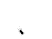

<h1 style="text-align: center;" >We make the army call the army.🔞⚔️</h1>

[%2C+emacs%2C+hyprland.;%D8%B9%D9%8D%D8%B5%D8%A2%D9%85+%D9%84%D9%8E%D8%A7%D8%B4%D9%90%D9%8A%D9%8E%D9%86%D9%91+>)](https://git.io/typing-svg)

`----- -..- .... .-.`

### My favorite tools and technologies ⚙️🛠️💻

- Bash 💻
- C/C++ 🧑‍💻
- HTML / JavaScript / CSS 🌐
- Python 🐍
- Rust 🦀
- Docker, Vagrant 🐳

### Links 🔗🌐

- [Mastodon](https://infosec.exchange/@0xHr) 🐘

<!--
**EsamLasheen/EsamLasheen** is a ✨ _special_ ✨ repository because its `README.md` (this file) appears on your GitHub profile.

Here are some ideas to get you started:

- 🔭 I’m currently working on ...
- 🌱 I’m currently learning ...
- 👯 I’m looking to collaborate on ...
- 🤔 I’m looking for help with ...
- 💬 Ask me about ...
- 📫 How to reach me: ...
- 😄 Pronouns: ...
- ⚡ Fun fact: ...
-->
